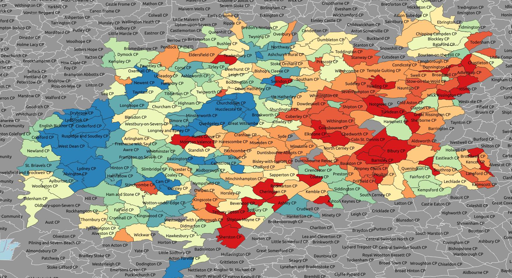

# House prices paid by parish

To obtain the latitude and longitude positions of each house sale value, the house price paid postcodes from the land registry were cross-referenced with OS code point data. The UK parish data was then uploaded to PostGIS, and an SQL query was used to calculate the average price within each parish. This information was imported into QGIS and used to apply a style to the parish polygons based on the average value..




# Average Price Paid Parish

## Download data

Donloading a csv file of property price paid data for each of the last three years, postcode coordinates, and
boundry line polygons.

```
$ wget bdline_gpkg_gb.zip
&& unzip bdline_gpkg_gb.zip
&& cd data
```
## Import bdline

Using ogr2ogr to convert the boundry line GeoPackage file into PostgreSQL file, reprojecting it from
OSGB1936 to WGS84, and importing it into the database.

```
ogr2ogr \
-f "PostgreSQL" \
-a_srs "EPSG:27700" \
```

```
-t_srs "EPSG:4326" \
-progress PG:"dbname='gis' host='$ip' port='5432' user='$user'
password='$password'" \
bdline_gb.gpkg
```
## Connect to server

Starting a psql instance on the client in order to interact with the database on the server.

```
psql -h 192.168.88.10 -U postgres gis
```
# Create priced paid polygons for every point

Using the point data already present in the database from the previous project to create a duplicate
polygon from the parish geometry table for every point each polygon contains, and appending the point
price paid to it.

### SELECT

```
parish.geom,
points.pounds
INTO pp_parish
FROM
parish INNER JOIN points
ON st_contains(parish.geom, points.geom);
```
## Find avarage point value for duplicate polygons

As in the previous project, avaraging the values of the duplicate polygons back one.

```
SELECT geom,avg(pounds)
INTO avg_pp_parish
FROM pp_parish
GROUP BY geom;
```
## Import new price paid polygons to file

```
Qgis > Database > DB Manager > Import Layer/File - Name: pp_parish
```
## Add price paid polygons layer to Qgis

```
Qgis > Layer > Add Layer > Add Vector Layer
Qgis > Database > DB Manager > Import Layer/File - Name: pp_parish
Vector Dataset(s): .shp
```

## Colour polygons by attribute field

```
Right click: Layer > Properties
Symbology > Single Symbol: Gradiated
Vaule: pounds
Colour Ramp: Spectral
Invert Colour Ramp
Segmentation: Equal Interval
```